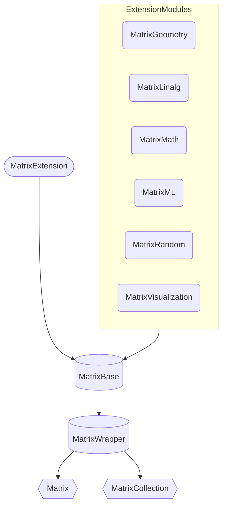
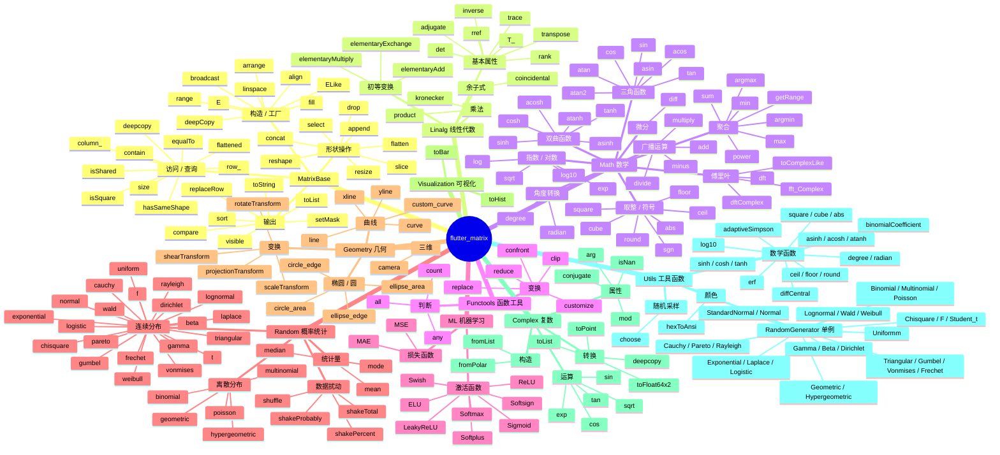

# Flutter Matrix  

---
<div style="text-align: center;">
    <a href="https://github.com/PythonnotJava/flutter_matrix">
        
    </a>
</div>

## 💡What's the Flutter Matrix?

<p style="text-indent: 2em">
The matrix class designed for Flutter supports any platform 
because it is implemented in pure Dart. It supports basic matrix operations,
linear algebra, probability theory and mathematical statistics, 
geometric simulation, center difference, and more.
</p>

<p style="text-indent: 2em">
Pub address : 
<a href="https://pub.dev/packages/flutter_matrix" target="_blank">
    https://pub.dev/packages/flutter_matrix
</a>
</p>

## 🗺️RoadMap



--- 




## 📄Need a local document?
<p style="text-indent: 2em">
Flutter Matrix provides a local doc 
(by markdown, but you need to rename the folder to docs first)
folder and a mkdocs-based building module.
If you have Python in your environment, 
change to the same directory as the mkdocs.yml file and run the following command.
</p>

```text
pip install mkdocs mkdocs-material pymdown-extensions mkdocs-material-extensions
```
<p style="text-indent: 2em">
After successfully installing the above libraries, run the following command again. 
You will find that you have generated a folder named site. Open the index.html in the folder to browse the online web documents.

</p>

```
mkdocs build
```

<p style="text-indent: 2em">
I also provide online documents: <a href="https://www.robot-shadow.cn/src/pkg/Flutter_Matrix/site/">👉Click Me!👈</a>

</p>

## 🛎️Attention.
- Flutter Matrix can run in a pure Dart environment.

## ✍️Example
- Use `arrange` to generate a data matrix with evenly spaced intervals.
```dart
import 'package:flutter_matrix/matrix_type.dart';

main(){
  data_format = "%2.0f";
  var t = MatrixBase.linspace<Matrix>(
      row: 10, 
      column: 10, 
      start: 1, 
      end: 100, 
      keep: true
  );
  t.visible();
}
```
- Output.
```text
[
 [  1   2   3   4   5   6   7   8   9  10]
 [ 11  12  13  14  15  16  17  18  19  20]
 [ 21  22  23  24  25  26  27  28  29  30]
 [ 31  32  33  34  35  36  37  38  39  40]
 [ 41  42  43  44  45  46  47  48  49  50]
 [ 51  52  53  54  55  56  57  58  59  60]
 [ 61  62  63  64  65  66  67  68  69  70]
 [ 71  72  73  74  75  76  77  78  79  80]
 [ 81  82  83  84  85  86  87  88  89  90]
 [ 91  92  93  94  95  96  97  98  99 100]
]
```

- 3D transformation of geometry

