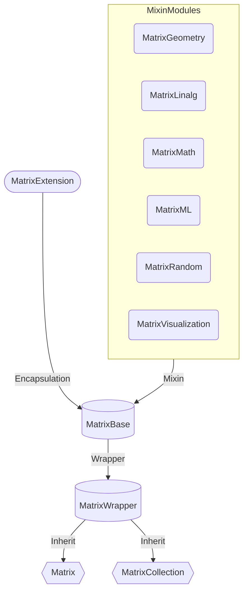

# 类型定义和构建

矩阵类由`MatrixBase`进行抽象到`MatrixWrapper`进行包装，并且封装了`Matrix`和`MatrxCollection`两个子类。
矩阵的底层是*二维浮点数组*的extension方法，该拓展类`MatrixExtension`在`matrix_extension`文件实现，同时，你也完全可以操作二位浮点数组的拓展方法来实现矩阵同样的效果。

矩阵类的具体实现路线图如下：



> 矩阵类
> - 内部使用`List<List<double>>`（属性名self)存储核心数据，默认构造时，不考虑是否为空。
> - 如果一个形状（属性名shape）被传入，它将基于传入的形状，传入时可以指定形状，避免形状再计算。
> - 为了增加灵活性，矩阵中的列表在创建时默认都是可增长的，这也是不采用`Float64List`这类性能列表的原因。
> - 在实现矩阵方法时，一切从简，更多的考虑是逻辑而不是性能，但是也不是完全离谱到抛弃性能。
> - 矩阵的一切数据是double类型。

## MatrixBase
> MatrixBase是抽象基类，其子类必须实现_fromList方法（细节如下）来进行构造，该方法设计的目的是将一个列表直接包装为矩阵，而不是拷贝再包装。
```text
abstract class MatrixBase<T extends MatrixBase<T>> {
  late List<List<double>> self;
  late List<int> shape;
    
  T _fromList(List<List<double>> data, {
    int? known_row,
    int? known_column
  });  // 子类必须实现
  ......
}
```

## MatrixWrapper
> - MatrixWrapper是对MatrixBase的封装，使得任何类`ClassName`可以从其进行拓展，但是`ClassName`必须在调用前使用`registerSubClassFromListConstructor`注册构造函数使得能够被MatrixBase识别。
> - 同时建议MatrixWrapper的任意子类都实现基本构造函数和fromList两种构造函数（前者负责拷贝原列表构造，后者负责引用原列表构造），同时必须实现_fromList方法。
```text
class MatrixWrapper<T extends MatrixBase<T>> extends MatrixBase<T>
    with
        MatrixFunctools<T>,
        MatrixGeometry<T>,
        MatrixLinalg<T>,
        MatrixMath<T>,
        MatrixML<T>,
        MatrixRandom<T>,
        MatrixVisualization<T> {
  MatrixWrapper(List<List<num>> data, {int? known_row, int? known_column}) {
    super.self = MatrixExtension.constructor(data);
    super.shape = [known_row ?? data.length, known_column ?? data[0].length];
  }

  MatrixWrapper.fromList(List<List<double>> data,
      {int? known_row, int? known_column}) {
    super.self = data;
    super.shape = [known_row ?? data.length, known_column ?? data[0].length];
  }

  @override
  T _fromList(List<List<double>> data, {int? known_row, int? known_column}) {
    return MatrixWrapper<T>.fromList(data, known_row: known_row, known_column: known_column)
    as T;
  }
}
```

## 关于可实例化子类Matrix和MatrixCollection
> 这二者区别是，Matrix不根据实例地址进行哈希，MatrixCollection每个实例有唯一哈希值；Matrix判断`==`是对比同类实例相同数据，而MatrixCollection则根据是不是同一个引用对象。
> 
> 另外，MatrixCollection附带了一个binds属性，可以动态的增减属性。
```dart
import 'package:flutter_matrix/matrix_type.dart';

main(){
  final mt1 = MatrixBase.E<Matrix>(n: 4);
  final mt2 = MatrixBase.E<Matrix>(n: 4);
  var mp = {
    mt1 : 1,
    mt2 : 2
  };
  print(mp[mt1]);  // 2
  print(mp[mt2]);  // 2
  print(mt1 == mt2);  // true

  final mt3 = MatrixBase.E<MatrixCollection>(n: 4);
  final mt4 = MatrixBase.E<MatrixCollection>(n: 4);
  var mp2 = {
    mt3 : 3,
    mt4 : 4
  };
  print(mp2[mt3]);  // 3
  print(mp2[mt4]);  // 4
  print(mt3 == mt4);  // false
}
```

## Matrix构造
## test
```dart
import 'package:flutter_matrix/matrix_type.dart';

main(){
  final List<List<double>> data = [
    [4, 6, 2],
    [6, 2, 0],
    [1, 2, 3]
  ];
  var mt = Matrix(data);
  mt.visible();
  var mt1 = Matrix.fromList(data);
  mt1.visible();
  data[0][0] = 9;
  mt.visible();
  mt1.visible();
}
```
### output
```text
[
 [4.00000 6.00000 2.00000]
 [6.00000 2.00000 0.00000]
 [1.00000 2.00000 3.00000]
]
[
 [4.00000 6.00000 2.00000]
 [6.00000 2.00000 0.00000]
 [1.00000 2.00000 3.00000]
]
[
 [4.00000 6.00000 2.00000]
 [6.00000 2.00000 0.00000]
 [1.00000 2.00000 3.00000]
]
[
 [9.00000 6.00000 2.00000]
 [6.00000 2.00000 0.00000]
 [1.00000 2.00000 3.00000]
]
```

## MatrixExtension
> MatrixExtension对二维矩阵的拓展**大部分**方法不仅限于每行等长的二维矩阵，对非等长也适用

## 注意
> 后续文档仍以Matrix类测试为主

[下一篇：基础操作](basement.md)