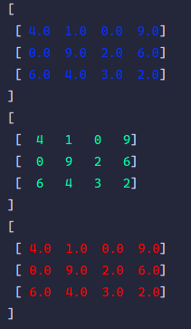

# 基础操作

## registerSubClassFromListConstructor
- 把子类Type注册到抽象基类，FromListConstructor是构造函数，建议为共享列表的构造函数 
```text
void registerSubClassFromListConstructor(Type, FromListConstructor)
```
### test
```text
import 'dart:math';

import 'package:flutter_matrix/matrix_type.dart';

class SparseMatrix extends MatrixWrapper<SparseMatrix> {
  SparseMatrix(List<List<num>> data, {int? known_row, int? known_column}) :
        super(data, known_row: known_row, known_column: known_column);

  SparseMatrix.fromList(List<List<double>> data, {int? known_row, int? known_column}) :
        super.fromList(data, known_row: known_row, known_column: known_column);

  SparseMatrix.buildBySparsity({
    required double sparsity,
    required int row,
    required int column,
  }) : super(
    _generateSparseData(sparsity: sparsity, row: row, column: column),
    known_row: row,
    known_column: column,
  );

  static List<List<double>> _generateSparseData({
    required double sparsity,
    required int row,
    required int column,
  }) {
    final rand = Random();
    final total = row * column;
    final onesCount = ((1 - sparsity) * total).round();

    List<int> allIndices = List.generate(total, (i) => i);
    allIndices.shuffle(rand);
    Set<int> oneIndices = allIndices.take(onesCount).toSet();

    return List.generate(row, (i) {
      return List.generate(column, (j) {
        int idx = i * column + j;
        return oneIndices.contains(idx) ? 1.0 : 0.0;
      });
    });
  }
}

main(){
  data_format = "%2.0f";
  registerSubClassFromListConstructor(SparseMatrix, SparseMatrix.new);
  var mt = MatrixBase.fill<SparseMatrix>(number: 0, row: 4, column: 5);
  mt.visible();
  SparseMatrix.buildBySparsity(sparsity: 0.8, row: 2, column: 5).visible();
}
```
### output
```text
[
 [  0   0   0   0   0]
 [  0   0   0   0   0]
 [  0   0   0   0   0]
 [  0   0   0   0   0]
]
[
 [  0   0   0   0   1]
 [  0   1   0   0   0]
]
```
## fill
- 生成被number填充的矩阵
```text
static T fill<T extends MatrixBase<T>>({
    required double number,
    required int row,
    required int column
  })
```
### test
```text
import 'package:flutter_matrix/matrix_type.dart';

main(){
  data_format = "%2.2f";
  MatrixBase.fill<Matrix>(number: 3.14, row: 4, column: 5).visible();
}
```
### output
```text
[
 [ 3.14  3.14  3.14  3.14  3.14]
 [ 3.14  3.14  3.14  3.14  3.14]
 [ 3.14  3.14  3.14  3.14  3.14]
 [ 3.14  3.14  3.14  3.14  3.14]
]
```
## arrange
- 从start开始生成间隔1的矩阵
```text
static T arrange<T extends MatrixBase<T>>({
    double start = 0.0,
    required int row,
    required int column
  })
```
### test
```text
import 'package:flutter_matrix/matrix_type.dart';

main(){
  data_format = "%2.0f";
  MatrixBase.arrange<Matrix>(row: 3, column: 7, start: 0).visible();
}
```
### output
```text
[
 [  0   1   2   3   4   5   6]
 [  7   8   9  10  11  12  13]
 [ 14  15  16  17  18  19  20]
]
```

## linspace
- 生成从start开始到end结束的均匀数据，keep为true则保留到end结束
- 允许start不大于end
```text
static T linspace<T extends MatrixBase<T>>({
    required double start,
    required double end,
    bool keep = true,
    required int row,
    required int column
  })
```
### test
```text
import 'package:flutter_matrix/matrix_type.dart';

main(){
  data_format = "%2.5f";
  MatrixBase.linspace<Matrix>(start: 0, end: 10, row: 2, column: 5).visible();
  MatrixBase.linspace<Matrix>(start: 0, end: 10, row: 2, column: 5, keep: false).visible();
  MatrixBase.linspace<Matrix>(start: 0, end: -10, row: 2, column: 5).visible();
  MatrixBase.linspace<Matrix>(start: 0, end: -10, row: 2, column: 5, keep: false).visible();
}
```
### output
```text
[
 [ 0.00000  1.11111  2.22222  3.33333  4.44444]
 [ 5.55556  6.66667  7.77778  8.88889 10.00000]
]
[
 [ 0.00000  1.00000  2.00000  3.00000  4.00000]
 [ 5.00000  6.00000  7.00000  8.00000  9.00000]
]
[
 [ 0.00000 -1.11111 -2.22222 -3.33333 -4.44444]
 [-5.55556 -6.66667 -7.77778 -8.88889 -10.00000]
]
[
 [ 0.00000 -1.00000 -2.00000 -3.00000 -4.00000]
 [-5.00000 -6.00000 -7.00000 -8.00000 -9.00000]
]
```

## deepCopy
- 深拷贝一个MatrixBase子类的数据来构造矩阵
- 仅仅是拷贝属性
```text
static T deepCopy<T extends MatrixBase<T>>(MatrixBase other)
```
### test
```text
import 'package:flutter_matrix/matrix_type.dart';

main(){
  data_format = "%2.0f";
  var mt = MatrixCollection([
    [1, 2, 3],
    [6, 6, 9]
  ]);
  mt.visible();
  var mt1 = MatrixBase.deepCopy<Matrix>(mt);
  mt1.visible();
  print(mt1.runtimeType);
}
```
### output
```text
[
 [  1   2   3]
 [  6   6   9]
]
[
 [  1   2   3]
 [  6   6   9]
]
Matrix
```

## broadcast
- 从最后一个维度开始广播多个矩阵，每个维度要么相等，要么其中一个为 1，否则广播失败。
```text
static List<T> broadcast<T extends MatrixBase<T>>(List<T> mts)
```
### test
```text
import 'package:flutter_matrix/matrix_type.dart';

main(){
  data_format = "%2.0f";
  var mt1 = Matrix.fromList([
    [1, 2, 3],
    [4, 5, 6]]
  );
  var mt2 = Matrix.fromList([
    [4],
    [7]]
  );
  var mt3 = Matrix.fromList([
    [5],
    [6]
  ]);
  for (final t in MatrixBase.broadcast([mt1, mt2, mt3])){
    t.visible();
  }

  var mt4 = Matrix.fromList([
    [9, 3, 1]
  ]);
  var mt5 = Matrix.fromList([
    [1, 2, 1]
  ]);
  MatrixBase.broadcast([mt1, mt4, mt5]).forEach((mt) => mt.visible());
}
```
### output
```text
[
 [  1   2   3]
 [  4   5   6]
]
[
 [  4   4   4]
 [  7   7   7]
]
[
 [  5   5   5]
 [  6   6   6]
]
[
 [  1   2   3]
 [  4   5   6]
]
[
 [  9   3   1]
 [  9   3   1]
]
[
 [  1   2   1]
 [  1   2   1]
]
```

##
- 从start开始，生成步长为step的矩阵
```text
static T range<T extends MatrixBase<T>>({
    double start = 0.0,
    double step = 1.0,
    required int row,
    required int column
  })
```
### test
```text
import 'package:flutter_matrix/matrix_type.dart';

main(){
  data_format = "%2.1f";
  MatrixBase.range<Matrix>(row: 2, column: 6, start: 0, step: 0.5).visible();
}
```
### output
```text
[
 [ 0.0  0.5  1.0  1.5  2.0  2.5]
 [ 3.0  3.5  4.0  4.5  5.0  5.5]
]
```

## E
- 生成n阶单位矩阵
```text
static T E<T extends MatrixBase<T>>({required int n})
```
### test
```text
import 'package:flutter_matrix/matrix_type.dart';

main(){
  data_format = "%2.1f";
  MatrixBase.E<Matrix>(n : 3).visible();
}
```
### output
```text
[
 [ 1.0  0.0  0.0]
 [ 0.0  1.0  0.0]
 [ 0.0  0.0  1.0]
]
```

## ELike
- 生成类单位矩阵，取决于行和列中的最小值
```text
static T ELike<T extends MatrixBase<T>>({required int row, required int column})
```
### test
```text
import 'package:flutter_matrix/matrix_type.dart';

main(){
  data_format = "%2.0f";
  MatrixBase.ELike<Matrix>(row: 3, column: 4).visible();
  MatrixBase.ELike<Matrix>(row: 4, column: 3).visible();
  MatrixBase.ELike<Matrix>(row: 3, column: 3).visible();
}
```
### output
```text
[
 [  1   0   0   0]
 [  0   1   0   0]
 [  0   0   1   0]
]
[
 [  1   0   0]
 [  0   1   0]
 [  0   0   1]
 [  0   0   0]
]
[
 [  1   0   0]
 [  0   1   0]
 [  0   0   1]
]
```

## align
- 根据最长的列表对其他短数据进行对齐。该方法基于原来的二位数组进行拓展，并非复制再操作
- 模式0：使用number补充缺失值
- 模式1：根据每行的原有数据进行重复补全，例如：最长为10，某行只有4、2、6，则补全为4、2、6、4、2、6、4、2、6、4，如果该行为空，全用number覆盖
- 其他模式：根据func自己设计规则，func的第一个参数表示当前行列表，请处理好空行情况
```text
static T align<T extends MatrixBase<T>>(List<List<double>> data,
      {int mode = 0,
      double number = double.nan,
      double Function(List<double> list)? func})
```
### test
```dart
import 'package:collection/collection.dart';
import 'package:flutter_matrix/matrix_type.dart';

main(){
  data_format = "%2.0f";
  final List<List<double>> data = [
    [1],
    [2, 0, 9, 7],
    [],
    [1, 1, 8, 3, 2],
    [8, 2],
    [9, 1, 2]
  ];
  final data2 = data.deepcopy;
  final data3 = data.deepcopy;
  MatrixBase.align<Matrix>(data, mode: 0, number: 1).visible();
  data.definePrint();
  MatrixBase.align<Matrix>(data2, mode: 1, number: double.nan).visible();
  MatrixBase.align<Matrix>(data3, mode: 2, func: (l) => l.isEmpty ? double.nan : l.max).visible();
}
```
### output
```text
[
 [  1   1   1   1   1]
 [  2   0   9   7   1]
 [  1   1   1   1   1]
 [  1   1   8   3   2]
 [  8   2   1   1   1]
 [  9   1   2   1   1]
]
[
 [  1   1   1   1   1]
 [  2   0   9   7   1]
 [  1   1   1   1   1]
 [  1   1   8   3   2]
 [  8   2   1   1   1]
 [  9   1   2   1   1]
]
[
 [  1   1   1   1   1]
 [  2   0   9   7   2]
 [NaN NaN NaN NaN NaN]
 [  1   1   8   3   2]
 [  8   2   8   2   8]
 [  9   1   2   9   1]
]
[
 [  1   1   1   1   1]
 [  2   0   9   7   9]
 [NaN NaN NaN NaN NaN]
 [  1   1   8   3   2]
 [  8   2   8   8   8]
 [  9   1   2   9   9]
]
```
## String
- 格式化输出矩阵，format是输出数据的统一格式，如果没有则使用data_format代替
- data_format作为全局变量允许被修改来控制输出
- color表示数据的颜色，是十六进制字符串。
```text
String toString({String? format, String color = '#ffd700'})
```
### test
```text
import 'package:flutter_matrix/matrix_type.dart';

main(){
  data_format = "%2.1f";
  final mt = Matrix.fromList([
    [4, 1, 0, 9],
    [0, 9, 2, 6],
    [6, 4, 3, 2]
  ]);
  print(mt.toString(color: '#0532ff'));
  print(mt.toString(format: '%2.0f', color: '#00ffa6'));
  print(mt.toString(color: '#ff0000'));
}
```
### output


## visible
- 包装了toString的功能并且添加了额外字符打印功能
- 快速查看矩阵
```text
void visible({
    String? format,
    String color = '#ffd700',
    String? start_point,
    String? end_point
})
```
### test
```text
import 'package:flutter_matrix/matrix_type.dart';

main(){
  data_format = "%2.1f";
  final mt = Matrix.fromList([
    [4, 1, 0, 9],
    [0, 9, 2, 6],
    [6, 4, 3, 2]
  ]);
  mt.visible(
      start_point: "-------------------Matrix-------------------",
      end_point: "--------------------------------------------"
  );
}
```
### output
```text
-------------------Matrix-------------------
[
 [ 4.0  1.0  0.0  9.0]
 [ 0.0  9.0  2.0  6.0]
 [ 6.0  4.0  3.0  2.0]
]
--------------------------------------------
```

## row_
- 获取某行的复制数据
```text
List<double> row_(int index)
```
### test
```text
import 'package:flutter_matrix/matrix_type.dart';

main(){
  final mt = Matrix.fromList([
    [4, 1, 0, 9],
    [0, 9, 2, 6],
    [6, 4, 3, 2]
  ]);
  final r = mt.row_(2);
  mt[2][2] = 13;
  print(r);
  print(mt[2]);
}
```
### output
```text
[6.0, 4.0, 3.0, 2.0]
[6.0, 4.0, 13.0, 2.0]
```

## column_
- 获取某列的复制数据
```text
List<double> column_(int index) 
```
### test
```text
import 'package:flutter_matrix/matrix_type.dart';

main(){
  final mt = Matrix.fromList([
    [4, 1, 0, 9],
    [0, 9, 2, 6],
    [6, 4, 3, 2]
  ]);
  final r = mt.column_(3);
  print(r);
}
```
### output
```text
[9.0, 6.0, 2.0]
```

## isShared
- 判断两个矩阵是不是共享了同一个数据
```text
bool isShared(covariant MatrixBase other)
```
### test
```text
import 'package:flutter_matrix/matrix_type.dart';

main(){
  data_format = "%2.0f";
  final List<List<double>> data = [
    [4, 1, 0, 9],
    [0, 9, 2, 6],
    [6, 4, 3, 2]
  ];
  final mt = Matrix.fromList(data);
  final mc = MatrixCollection.fromList(data);
  print(mt.isShared(mc));
  mt[0][0] = 2;
  mc.visible();
}
```
### output
```text
true
[
 [  2   1   0   9]
 [  0   9   2   6]
 [  6   4   3   2]
]
```

## setMask
- 根据传入值决定是不是要将矩阵中的nan、无穷大替换
```text
void setMask({double? nan_mask, double? inf_mask, double? nag_inf_mask})
```
### test
```text
import 'package:flutter_matrix/matrix_type.dart';

main(){
  data_format = "%5.3f";
  final List<List<double>> data = [
    [4, double.nan, 0, 9],
    [0, 9, double.infinity, 6],
    [6, 4, double.negativeInfinity, 2]
  ];
  final mt = Matrix.fromList(data)..visible();
  mt..setMask(nan_mask: 1, inf_mask: 3, nag_inf_mask: 5)..visible(format: "%2.0f");
}
```
### output
```text
[
 [    4.000       NaN     0.000     9.000]
 [    0.000     9.000  Infinity     6.000]
 [    6.000     4.000 -Infinity     2.000]
]
[
 [  4   1   0   9]
 [  0   9   3   6]
 [  6   4   5   2]
]
```

## contain
- 矩阵中是否包含某个数据（不包括double.nan）
```text
bool contain(double element)
```
### test
```text
import 'package:flutter_matrix/matrix_type.dart';

main(){
  final List<List<double>> data = [
    [4, double.nan, 0, 9],
    [0, 9, double.infinity, 6],
    [6, 4, double.negativeInfinity, 2]
  ];
  final mt = Matrix.fromList(data)..visible();
  print(mt.contain(double.infinity));
  print(mt.contain(double.negativeInfinity));
  // 根据 IEEE 754 的定义：NaN 与任何值（包括它自己）进行相等比较时，结果都是 false。
  print(mt.contain(double.nan));
  print(mt.any((x) => x.isNaN));
}
```
### output
```text
[
 [4.00000    NaN 0.00000 9.00000]
 [0.00000 9.00000 Infinity 6.00000]
 [6.00000 4.00000 -Infinity 2.00000]
]
true
true
false
true
```

##
- 判断两个同类矩阵是不是数据一样或者矩阵是不是全是某个数据
- `==`运算符仅可以对比同类矩阵
```text
bool equalTo(Object other)
```
### test
```text
import 'package:flutter_matrix/matrix_type.dart';

main(){
  var m = MatrixBase.fill<Matrix>(number: 2, row: 3, column: 5);
  print(m.equalTo(2));
  print(m.equalTo(MatrixBase.fill<Matrix>(number: 2, row: 3, column: 5)));
}
```
### output
```text
true
true
```

## toList
- 将矩阵转为不同类型的数据列表
- 其中转复数的时候，矩阵列必须为2
```text
List<dynamic> toList(Typed type)
```
### test
```text
import 'package:flutter_matrix/matrix_type.dart';
import 'package:flutter_matrix/unrelated_util.dart';

main(){
  var m = Matrix.fromList([[-2, 3], [0, 1]]);
  for (var t in Typed.values){
    print("${t.name}, ${m.toList(t)}");
  }
}
```
### output
```text
int8, [[-2, 3], [0, 1]]
int16, [[-2, 3], [0, 1]]
int32, [[-2, 3], [0, 1]]
int64, [[-2, 3], [0, 1]]
int, [[-2, 3], [0, 1]]
float32, [[-2.0, 3.0], [0.0, 1.0]]
float64, [[-2.0, 3.0], [0.0, 1.0]]
double, [[-2.0, 3.0], [0.0, 1.0]]
bool, [[true, true], [false, true]]
uint8, [[254, 3], [0, 1]]
uint16, [[65534, 3], [0, 1]]
uint32, [[4294967294, 3], [0, 1]]
uint64, [[-2, 3], [0, 1]]
complex, [Complex(-2.0, 3.0), Complex(0.0, 1.0)]
```

## append
- 向矩阵中添加数据，设计之初，就已经规定矩阵是可增减的
```text
void append(List<double> data, {bool horizontal = true})
```
### test
```text
import 'package:flutter_matrix/matrix_type.dart';

main(){
  data_format = "%2.0f";
  var m = Matrix.fromList([[-2, 3], [0, 1]]);
  m..append([3, 2], horizontal: true)..visible();
  print(m.shape);
  m..append([0, 0, 0], horizontal: false)..visible();
  print(m.shape);
}
```
### output
```text
[
 [ -2   3]
 [  0   1]
 [  3   2]
]
[3, 2]
[
 [ -2   3   0]
 [  0   1   0]
 [  3   2   0]
]
[3, 3]
```

## hasSameShape
- 判断是不是相同形状
```text
bool hasSameShape(covariant MatrixBase other)
```
### test
```text
import 'package:flutter_matrix/matrix_type.dart';

main(){
  var m = Matrix.fromList([[-2, 3], [0, 1]]);
  print(m.hasSameShape(MatrixCollection([[-2, 3], [0, 1]])));
  print(m.hasSameShape(MatrixCollection([[-2, 3, 1], [0, 5, 1]])));
}
```
### output
```text
true
false
```

## size
- 矩阵数据量
```text
int get size
```
### test
```text
import 'package:flutter_matrix/matrix_type.dart';

main(){
  print(MatrixBase.arrange<Matrix>(row: 65, column: 23,).size);
}
```
### output
```text
1495
```

## flattened
- 矩阵横向展平为一个向量
```text
List<double> get flattened
```
### test
```text
import 'package:flutter_matrix/matrix_type.dart';

main(){
  print(MatrixBase.arrange<Matrix>(row: 2, column: 3).flattened);
}
```
### output
```text
[0.0, 1.0, 2.0, 3.0, 4.0, 5.0]
```

## isSquare
- 判断矩阵是不是方阵
```text
bool get isSquare
```
### test
```text
import 'package:flutter_matrix/matrix_type.dart';

main(){
  print(MatrixBase.arrange<Matrix>(row: 2, column: 3).isSquare);
  print(MatrixBase.arrange<Matrix>(row: 2, column: 2).isSquare);
}
```
### output
```text
false
true
```

## hashCode和`==`
- `==`仅支持相同类实例的数据比较
- 两个对象`==`为true的时候，哈希码也必须相同
- 参考：https://api.dart.dev/dart-core/Object/hashCode.html
```text
int get hashCode
bool operator ==(Object other)
```
### test
```text
import 'package:flutter_matrix/matrix_type.dart';

main(){
  var t1 = MatrixBase.arrange<Matrix>(row: 2, column: 3);
  var t2 = MatrixBase.arrange<Matrix>(row: 2, column: 3);
  print(t1 == t2);
  print(t1.hashCode == t2.hashCode);
  final mp = {
    t1 : 1,
    t2 : 2
  };
  print(mp[t1]); 
}
```
### output
```text
true
true
2
```

## `>`、`>=`、`<`、`<=`
- 对同类矩阵实例之前进行数据比较
- 矩阵和数据比较
```text
bool operator >(Object other)
bool operator >=(Object other)
bool operator <(Object other)
bool operator <=(Object other)
```
### test
```text
import 'package:flutter_matrix/matrix_type.dart';

main(){
  var t1 = Matrix.fromList([
    [3, 6, 2, 1],
    [0, 2, -3, 3]
  ]);
  var t2 = Matrix.fromList([
    [3, 6, 2, 1],
    [0, 2, -3, 3]
  ]) + 0.001;
  print(t1 > -3);
  print(t1 >= -3);
  print(t1 <= t2);
  print(t1 < t2);
}
```
### output
```text
false
true
true
true 
```

## `[]`和`[]=`
- 获取和替换某行
```text
void operator []=(int index, List<double> value)
List<double> operator [](int index)
```
### test
```text
import 'package:flutter_matrix/matrix_type.dart';

main(){
  data_format = "%2.0f";
  var t1 = Matrix.fromList([
    [3, 6, 2, 1],
    [0, 2, -3, 3]
  ]);
  print(t1[1]);
  print(identityHashCode(t1.self[1]));
  t1[1] = [2, 2, 4, 2];
  t1.visible();
  print(identityHashCode(t1.self[1]));
  t1.replaceRow(1, [2, 2, 2, 2]);
  t1.visible();
  print(identityHashCode(t1.self[1]));
}
```
### output
```text
[0.0, 2.0, -3.0, 3.0]
239251943
[
 [  3   6   2   1]
 [  2   2   4   2]
]
67174965
[
 [  3   6   2   1]
 [  2   2   2   2]
]
67174965
```

## replaceRow
- 对某行的值进行替换且不改变列表地址
```text
void replaceRow(int index, List<double> value)
```

### test
```dart
import 'package:flutter_matrix/matrix_type.dart';

main(){
  data_format = "%2.0f";
  var t1 = Matrix.fromList([
    [3, 6, 2, 1],
    [0, 2, -3, 3]
  ]);
  print(t1[1]);
  print(identityHashCode(t1.self[1]));
  t1[1] = [2, 2, 4, 2];
  t1.visible();
  print(identityHashCode(t1.self[1]));
  t1.replaceRow(1, [2, 2, 2, 2]);
  t1.visible();
  print(identityHashCode(t1.self[1]));
}
```
### output
```text
[0.0, 2.0, -3.0, 3.0]
239251943
[
 [  3   6   2   1]
 [  2   2   4   2]
]
67174965
[
 [  3   6   2   1]
 [  2   2   2   2]
]
67174965
```
## deepcopy
- 深拷贝类本身数据来创建另一个同类
- MatrixCollection不会被拷贝binds
```text
T get deepcopy
```

### test
```dart
import 'package:flutter_matrix/matrix_type.dart';

main(){
  data_format = "%2.0f";
  var t1 = MatrixCollection.fromList([
    [3, 6, 2, 1],
    [0, 2, -3, 3]
  ]);
  t1.setter('key', 'value');
  final t2 = t1.deepcopy..visible();
  print(t2.binds);
}
```
### output
```text
[
 [  3   6   2   1]
 [  0   2  -3   3]
]
{}
```
## concat
- 拼接两个矩阵
```text
T concat({required T other, bool horizontal = true})
```

### test
```dart
import 'package:flutter_matrix/matrix_type.dart';

main(){
  data_format = "%2.0f";
  var t1 = Matrix.fromList([
    [3, 6, 2, 1],
    [0, 2, -3, 3]
  ]);
  var t2 = MatrixBase.fill<Matrix>(number: 1, row: 2, column: 2);
  var t3 = MatrixBase.fill<Matrix>(number: 1, row: 3, column: 4);
  t1.concat(other: t2, horizontal: true).visible();
  t1.concat(other: t3, horizontal: false).visible();
}
```
### output
```text
[
 [  3   6   2   1   1   1]
 [  0   2  -3   3   1   1]
]
[
 [  3   6   2   1]
 [  0   2  -3   3]
 [  1   1   1   1]
 [  1   1   1   1]
 [  1   1   1   1]
]
```
## reshape
- 对矩阵重塑形状，必须保证前后形状的尺寸一样
```text
T reshape({required int row, required int column})
```

### test
```dart
import 'package:flutter_matrix/matrix_type.dart';

main(){
  data_format = "%2.0f";
  var t1 = Matrix.fromList([
    [3, 6, 2, 1],
    [0, 2, -3, 3]
  ]);
  t1.reshape(row: 1, column: 8).visible();
}
```
### output
```text
[
 [  3   6   2   1   0   2  -3   3]
]
```
## resize
- 重塑矩阵尺寸，如果尺寸变小，则去除多余数据；如果尺寸变大，则使用number进行补充
```text
T resize({required int row, required int column, double number = 0.0})
```

### test
```dart
import 'package:flutter_matrix/matrix_type.dart';

main(){
  data_format = "%2.0f";
  var t1 = Matrix.fromList([
    [3, 6, 2, 1],
    [0, 2, -3, 3]
  ]);
  t1.resize(row: 3, column: 3, number: 2).visible();
  t1.resize(row: 2, column: 2).visible();
}
```
### output
```text
[
 [  3   6   2]
 [  1   0   2]
 [ -3   3   0]
]
[
 [  3   6]
 [  2   1]
]    
```
## flatten
- 按照方向展平矩阵为向量
```text
T flatten({bool horizontal = true})
```

### test
```dart
import 'package:flutter_matrix/matrix_type.dart';

main(){
  data_format = "%2.0f";
  var t1 = Matrix.fromList([
    [3, 6, 2, 1],
    [0, 2, -3, 3]
  ]);
  t1.flatten(horizontal: false).visible();
  t1.flatten(horizontal: true).visible();
}
```
### output
```text
[
 [  3   0   6   2   2  -3   1   3]
]
[
 [  3   6   2   1   0   2  -3   3]
]
```
## slice
- 切片操作，获取从 start 到 end（包含）的部分
- 如果 end 未设置，则从 start 处截取剩余部分
- 允许 start 大于 end，以进行反向截取
```text
T slice({required int start, int? end, bool horizontal = true})
```

### test
```dart
import 'package:flutter_matrix/matrix_type.dart';

main(){
  data_format = "%2.0f";
  var t1 = Matrix.fromList([
    [3, 6, 2, 1],
    [0, 2, -3, 3],
    [9, 9, 8, 8],
    [5, 4, 3, 1]
  ]);
  t1.slice(start: 2, horizontal: true).visible();
  t1.slice(start: 2, horizontal: false).visible();
  t1.slice(start: 0, end: 2, horizontal: false).visible();
  t1.slice(start: 3, end: 1, horizontal: true).visible();
  t1.slice(start: 3, end: 1, horizontal: false).visible();
}
```
### output
```text
[
 [  9   9   8   8]
 [  5   4   3   1]
]
[
 [  2   1]
 [ -3   3]
 [  8   8]
 [  3   1]
]
[
 [  3   6   2]
 [  0   2  -3]
 [  9   9   8]
 [  5   4   3]
]
[
 [  5   4   3   1]
 [  9   9   8   8]
 [  0   2  -3   3]
]
[
 [  1   2   6]
 [  3  -3   2]
 [  8   8   9]
 [  1   3   4]
]
```
## select
- 选择指定的行或列以形成新的矩阵
- 选择可以按任意顺序进行
- 可以重复
```text
T select({required List<int> target, bool horizontal = true})
```

### test
```dart
import 'package:flutter_matrix/matrix_type.dart';

main(){
  data_format = "%2.0f";
  var t1 = Matrix.fromList([
    [3, 6, 2, 1],
    [0, 2, -3, 3],
    [9, 9, 8, 8],
    [5, 4, 3, 1]
  ]);
  t1.select(target: [0, 0, 0, 1], horizontal: true).visible();
  t1.select(target: [0, 0, 0, 1], horizontal: false).visible();
  t1.select(target: [0, 2, 3, 1], horizontal: false).visible();
}
```
### output
```text
[
 [  3   6   2   1]
 [  3   6   2   1]
 [  3   6   2   1]
 [  0   2  -3   3]
]
[
 [  3   3   3   6]
 [  0   0   0   2]
 [  9   9   9   9]
 [  5   5   5   4]
]
[
 [  3   2   1   6]
 [  0  -3   3   2]
 [  9   8   8   9]
 [  5   3   1   4]
]
```
## drop
- 获取删除一些索引后剩余部分组成的矩阵。输入是一个整数的集合 
```text
T drop({required Set<int> target, bool horizontal = true})
```

### test
```dart
import 'package:flutter_matrix/matrix_type.dart';

main(){
  data_format = "%2.0f";
  var t1 = Matrix.fromList([
    [3, 6, 2, 1],
    [0, 2, -3, 3],
    [9, 9, 8, 8],
    [5, 4, 3, 1]
  ]);
  t1.drop(target: {0, 3}, horizontal: true).visible();
  t1.drop(target: {1, 3}, horizontal: false).visible();
}
```
### output
```text
[
 [  0   2  -3   3]
 [  9   9   8   8]
]
[
 [  3   2]
 [  0  -3]
 [  9   8]
 [  5   3]
]
```
## sort
- 对矩阵数据进行排序
- dim表示维度操作方式，0表示行方向单独操作、1表示列方向单独操作、其他整数表示整体操作，其他包含dim参数的方法原理同上
- reverse为true表示从大到小排序
```text
void sort({bool reverse = false, int dim = -1})
```

### test
```dart
import 'package:flutter_matrix/matrix_type.dart';

main(){
  data_format = "%8.0f";
  var t1 = Matrix.fromList([
    [3, 6, 2, 1],
    [0, 2, -3, 3],
    [9, double.infinity, 8, 8],
    [5, 4, 3, double.negativeInfinity]
  ]);
  t1
    ..visible()
    ..sort(reverse: true, dim: 0)
    ..visible()
    ..sort(reverse: false, dim: 1)
    ..visible()
    ..sort(reverse: true, dim: -1)
    ..visible()
    ..sort(reverse: false, dim: 2)
    ..visible();
}
```
### output
```text
[
 [        3         6         2         1]
 [        0         2        -3         3]
 [        9  Infinity         8         8]
 [        5         4         3 -Infinity]
]
[
 [        6         3         2         1]
 [        3         2         0        -3]
 [ Infinity         9         8         8]
 [        5         4         3 -Infinity]
]
[
 [        3         2         0 -Infinity]
 [        5         3         2        -3]
 [        6         4         3         1]
 [ Infinity         9         8         8]
]
[
 [ Infinity         9         8         8]
 [        6         5         4         3]
 [        3         3         2         2]
 [        1         0        -3 -Infinity]
]
[
 [-Infinity        -3         0         1]
 [        2         2         3         3]
 [        3         4         5         6]
 [        8         8         9  Infinity]
]
```
## `+` 、`-` 、`*` 、`/`
- 加减乘除的对象是同类或者数字
- 其中`*`表示矩阵的Hadamard积
```text
T operator +(Object other)
T operator -(Object other)
T operator *(Object other)
T operator /(Object other)
```

### test
```dart
import 'package:flutter_matrix/matrix_type.dart';

main(){
  data_format = "%8.0f";
  var t1 = Matrix.fromList([
    [3, 6, 2, 1],
    [0, 2, -3, 3],
    [9, double.infinity, 8, 8],
    [5, 4, 3, double.negativeInfinity]
  ]);
  var t2 = MatrixBase.fill<Matrix>(number: 2, row: 4, column: 4);
  t2[1][0] = 0;
  print(t1 / 2);
  print(t1 * t2);
  print(t1 + 1);
  print(t1 - 1);
  print(t1 + t2);
  print(t1 / t2);
}
```
### output
```text
[
 [        2         3         1         1]
 [        0         1        -2         2]
 [        5  Infinity         4         4]
 [        3         2         2 -Infinity]
]
[
 [        6        12         4         2]
 [        0         4        -6         6]
 [       18  Infinity        16        16]
 [       10         8         6 -Infinity]
]
[
 [        4         7         3         2]
 [        1         3        -2         4]
 [       10  Infinity         9         9]
 [        6         5         4 -Infinity]
]
[
 [        2         5         1         0]
 [       -1         1        -4         2]
 [        8  Infinity         7         7]
 [        4         3         2 -Infinity]
]
[
 [        5         8         4         3]
 [        0         4        -1         5]
 [       11  Infinity        10        10]
 [        7         6         5 -Infinity]
]
[
 [        2         3         1         1]
 [      NaN         1        -2         2]
 [        5  Infinity         4         4]
 [        3         2         2 -Infinity]
]
```

## compare
- 逐一比较两个矩阵的对应元素
- 其中 0 表示大于，1 表示小于，2 表示大于等于，3 表示小于等于，4 表示不等于，其他值表示等于
- 返回每个比较位置的 bool 值，最终形成一个二维布尔数组
```text
List<BoolList> compare({required T other, int which = -1}) 
```

### test
```text
import 'package:flutter_matrix/matrix_type.dart';

main(){
  var t1 = Matrix.fromList([
    [3, -2, 2, 1],
    [0, 2, 13, 3],
    [9, double.negativeInfinity, 8, 8]
  ]);
  var t2 = MatrixBase.fill<Matrix>(number: 2, row: 3, column: 4);
  for (var i in List.generate(6, (_) => _)) {
    print(t1.compare(other: t2, which: i));
  }
}
```

## output
```text
[[true, false, false, false], [false, false, true, true], [true, false, true, true]]
[[false, true, false, true], [true, false, false, false], [false, true, false, false]]
[[true, false, true, false], [false, true, true, true], [true, false, true, true]]
[[false, true, true, true], [true, true, false, false], [false, true, false, false]]
[[true, true, false, true], [true, false, true, true], [true, true, true, true]]
[[false, false, true, false], [false, true, false, false], [false, false, false, false]]
```

## `^`
- 矩阵数据的number幂次方
```text
T operator ^ (Object other)
```
### test
```dart
import 'package:flutter_matrix/matrix_type.dart';

main(){
  data_format = "%3.5f";
  var mt = Matrix.fromList([
    [4.3, 3, -5, 0.5],
    [5, 9, 10, double.negativeInfinity],
    [-5, 3, 0, double.infinity],
  ]);
  (mt ^ 2).visible();
}
```
### output
```text
[
 [ 18.49000   9.00000  25.00000   0.25000]
 [ 25.00000  81.00000 100.00000  Infinity]
 [ 25.00000   9.00000   0.00000  Infinity]
]
```
[下一篇：辅助](functools.md)