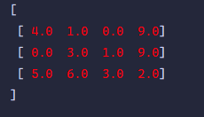
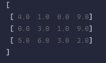
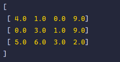

# 类型定义和构建

> 矩阵是矩阵类。
> - 内部使用`List`（属性名self)存储核心数据，默认构造时，不考虑是否为空。
> - 如果一个形状（属性名shape）被传入，它将基于传入的形状，传入时可以指定形状，避免形状再计算。
> - 为了增加灵活性，矩阵中的列表在创建时默认都是可增长的。
> - 在实现矩阵方法时，一切从简，更多的考虑是逻辑而不是性能，但是也不是完全离谱到抛弃性能。
> - 矩阵的一切数据是double类型。

## 基础构造函数
> Matrix(List<List<num>> data, {int? known_row, int? known_column})
>   
> 传入一个二维列表并复数数据存储到矩阵，可以选择性传入已知的形状参数

### test
```dart
import 'package:flutter_matrix/matrix_type.dart';

main() {
  var mt1 = Matrix([
    [4, 1, 0, 9],
    [0, 3, 1, 9],
    [5, 6, 3, 2],
  ]);
  print(mt1);
}
```

### output
```text
[
 [4.00000 1.00000 0.00000 9.00000]
 [0.00000 3.00000 1.00000 9.00000]
 [5.00000 6.00000 3.00000 2.00000]
]
```

## Matrix.fromList
> Matrix.fromList(List<List<double>> data, {int? known_row, int? known_column})
> 
> 矩阵直接引用传入的列表，fromList是建议使用的构造函数，因为避免了复制这一步

### test
```text
import 'package:flutter_matrix/matrix_type.dart';

main() {
  List<List<double>> data = [
    [4, 1, 0, 9],
    [0, 3, 1, 9],
    [5, 6, 3, 2],
  ];
  var mt1 = Matrix.fromList(data);
  data[0][0] = 10;
  print(mt1.toString(format: "%2.1f"));
}
```

### output
```text
[
 [10.0  1.0  0.0  9.0]
 [ 0.0  3.0  1.0  9.0]
 [ 5.0  6.0  3.0  2.0]
]
```

## Matrix.fill
> Matrix.fill({required double number, required int row, required int column})
> 
> 生成全是数据number的矩阵

### test
```text
import 'package:flutter_matrix/matrix_type.dart';

main() {
  var mt1 = Matrix.fill(number: 10, row: 2, column: 4);
  print(mt1.toString(format: "%2.0f"));
}
```

### output
```text
[
 [ 10  10  10  10]
 [ 10  10  10  10]
]
```

## Matrix.arrange
> Matrix.arrange({double start = 0.0, required int row, required int column})
> 
> 生成从start开始、间隔为1.0的矩阵

### test
```text
import 'package:flutter_matrix/matrix_type.dart';

main() {
  var mt1 = Matrix.arrange(row: 6, column: 2, start: 2.4);
  print(mt1.toString(format: "%2.2f"));
}
```

### output
```text
[
 [ 2.40  3.40]
 [ 4.40  5.40]
 [ 6.40  7.40]
 [ 8.40  9.40]
 [10.40 11.40]
 [12.40 13.40]
]
```

## Matrix.linspace
> Matrix.linspace({ required double start, required double end, bool keep = true, required int row, required int column})
> 
> 生成介于start到end的均匀数据，start可以不小于end，如果keep为true，则保留end作为结尾

### test
```text
import 'package:flutter_matrix/matrix_type.dart';

main() {
  data_format = "%2.3f";
  Matrix.linspace(start: 1, end: 2, row: 1, column: 10, keep: false).visible();
  Matrix.linspace(start: 1, end: 2, row: 1, column: 10, keep: true).visible();
}
```

### output
```text
[
 [ 1.000  1.100  1.200  1.300  1.400  1.500  1.600  1.700  1.800  1.900]
]
[
 [ 1.000  1.111  1.222  1.333  1.444  1.556  1.667  1.778  1.889  2.000]
]
```

## Matrix.deepcopy
> factory Matrix.deepcopy(Matrix other)
> 
> deepcopy会深度拷贝一个矩阵对象

### test
```text
import 'package:flutter_matrix/matrix_type.dart';

main() {
  data_format = "%2.3f";
  var a = Matrix.arrange(start: 1, row: 3, column: 3)..visible();
  var b = Matrix.deepcopy(a)..visible();
  print(identical(a, b));
}
```
### output
```text
[
 [ 1.000  2.000  3.000]
 [ 4.000  5.000  6.000]
 [ 7.000  8.000  9.000]
]
[
 [ 1.000  2.000  3.000]
 [ 4.000  5.000  6.000]
 [ 7.000  8.000  9.000]
]
false
```

## Matrix.E
> Matrix.E({required int n})
> 
> 生成一个n阶单位矩阵

### test
```text
import 'package:flutter_matrix/matrix_type.dart';

main() {
  data_format = "%1.0f";
  Matrix.E(n: 3).visible();
}
```

### output
```text
[
 [ 1  0  0]
 [ 0  1  0]
 [ 0  0  1]
]
```

## Matrix.range
> Matrix.range({double start = 0.0, double step = 1.0, required int row, required int column})
> 
> 生成一个从start开始，相邻数据间隔为step的矩阵

### test
```text
import 'package:flutter_matrix/matrix_type.dart';

main() {
  data_format = "%1.0f";
  Matrix.range(row: 2, column: 3, start: 2, step: -1).visible();
}
```
### output
```text
[
 [ 2  1  0]
 [-1 -2 -3]
]
```
## Matrix.E_like
> Matrix.E_like({required int row, required int column})
> 
> 生成一个类单位矩阵，在最小维度下主对角线矩阵上的数据为1.0，其他全是0.0
### test
```text
import 'package:flutter_matrix/matrix_type.dart';

main() {
  data_format = "%1.0f";
  Matrix.E_like(row: 3, column: 5).visible();
}
```
### output
```text
[
 [ 1  0  0  0  0]
 [ 0  1  0  0  0]
 [ 0  0  1  0  0]
]
```

## String toString
> String toString({String? format, String color = '#ffd700'})
> 
> 重载转字符串方法。format是输出格式，默认使用全局的data_format格式，可以使用color设置打印颜色，color是HEX格式的字符串

### test
```text
import 'package:flutter_matrix/matrix_type.dart';

main() {
  List<List<double>> data = [
    [4, 1, 0, 9],
    [0, 3, 1, 9],
    [5, 6, 3, 2],
  ];
  var mt1 = Matrix(data);
  data[0][0] = 10;
  print(mt1.toString(format: "%2.1f", color: '#ff0011')); // #666666, default
}
```

### output
<div class="image-container" style="display: flex;">
    
    
    
</div>

## bool operator == (Object other)
> 判断两个矩阵的数据是不是一模一样
> 
> 或者矩阵中的数据是否全是number
### test
```text
import 'package:flutter_matrix/matrix_type.dart';

main() {
  List<List<double>> data = [
    [4, 1, 0, 9],
    [0, 3, 1, 9],
    [5, 6, 3, 2],
  ];
  var mt1 = Matrix(data);
  data[0][0] = 10;
  var mt2 = Matrix.fromList(data);
  print(mt1 == mt2);
  print(Matrix.fill(number: 1, row: 2, column: 3) == 1);
}
```
### output
```text
false
true
```

## bool operator > (Object other)
> 判断矩阵对应位置数据是不是大于另一个矩阵的
> 
> 或者逐个和number比大小
### test
```text
import 'package:flutter_matrix/matrix_type.dart';

main() {
  List<List<double>> data = [
    [4, 1, 0, 9],
    [0, 3, 1, 9],
    [5, 6, 3, 2],
  ];
  var mt1 = Matrix(data);
  data[0][0] = 10;
  var mt2 = Matrix.fromList(data) - 1;
  print(mt1 > mt2);
  print(Matrix.fill(number: 1, row: 2, column: 3) > 1);
}
```
### output
```text
false
false
```

## bool operator >= (Object other)
> 判断矩阵对应位置数据是不是不小于另一个矩阵的
>
> 或者逐个和number比大小
### test
```text
import 'package:flutter_matrix/matrix_type.dart';

main() {
  List<List<double>> data = [
    [4, 1, 0, 9],
    [0, 3, 1, 9],
    [5, 6, 3, 2],
  ];
  var mt1 = Matrix(data);
  data[0][0] = 10;
  var mt2 = Matrix.fromList(data) - 1;
  print(mt1 >= mt2);
  print(Matrix.fill(number: 1, row: 2, column: 3) >= 1);
}
```
### output
```text
false
true
```

## bool operator < (Object other)
> 判断矩阵对应位置数据是不是小于另一个矩阵的
>
> 或者逐个和number比大小
### test
```text
import 'package:flutter_matrix/matrix_type.dart';

main() {
  List<List<double>> data = [
  [4, 1, 0, 9],
  [0, 3, 1, 9],
  [5, 6, 3, 2],
  ];
  var mt1 = Matrix(data);
  data[0][0] = 10;
  var mt2 = Matrix.fromList(data) - 1;
  print(mt1 < mt2);
  print(Matrix.fill(number: 1, row: 2, column: 3) < 1);
}
```
### output
```text
true
false
```
## bool operator <= (Object other)
### test
```text
import 'package:flutter_matrix/matrix_type.dart';

main() {
  List<List<double>> data = [
  [4, 1, 0, 9],
  [0, 3, 1, 9],
  [5, 6, 3, 2],
  ];
  var mt1 = Matrix(data);
  data[0][0] = 10;
  var mt2 = Matrix.fromList(data) - 1;
  print(mt1 <= mt2);
  print(Matrix.fill(number: 1, row: 2, column: 3) <= 1);
}
```
### output
```text
true
true
```
## Matrix operator ^ (num other)
> 获取矩阵的number次方
### test
```text
import 'package:flutter_matrix/matrix_type.dart';

main() {
  data_format = "%3.0f";
  (Matrix.arrange(row: 4, column: 4, start: 2) ^ 3).visible();
}
```
### output
```text
[
 [   8   27   64  125]
 [ 216  343  512  729]
 [1000 1331 1728 2197]
 [2744 3375 4096 4913]
]
```

## void operator []= (int index, List<double> value)
> 根据索引修改指向列表，而不是复制
### test
```text
import 'package:flutter_matrix/matrix_type.dart';

main() {
  var mt1 = Matrix.fill(number: 0, row: 4, column: 4);
  mt1.visible();
  List<double> a = [1, 2, 3, 4];
  mt1[1] = a;
  mt1.visible();
  a[1] = 7;
  mt1.visible();
}
```
### output
```text
[
 [0.00000 0.00000 0.00000 0.00000]
 [0.00000 0.00000 0.00000 0.00000]
 [0.00000 0.00000 0.00000 0.00000]
 [0.00000 0.00000 0.00000 0.00000]
]
[
 [0.00000 0.00000 0.00000 0.00000]
 [1.00000 2.00000 3.00000 4.00000]
 [0.00000 0.00000 0.00000 0.00000]
 [0.00000 0.00000 0.00000 0.00000]
]
[
 [0.00000 0.00000 0.00000 0.00000]
 [1.00000 7.00000 3.00000 4.00000]
 [0.00000 0.00000 0.00000 0.00000]
 [0.00000 0.00000 0.00000 0.00000]
]
```
## List<double> operator [] (int index)
> 根据索引获取某行列表
### test
```text
import 'package:flutter_matrix/matrix_type.dart';

main() {
  var mt1 = Matrix.fill(number: 0, row: 4, column: 4);
  final a = mt1[1];
  print(a);
  mt1[1][2] = 9;
  print(a);
}
```
### output
```text
[0.0, 0.0, 0.0, 0.0]
[0.0, 0.0, 9.0, 0.0]
```

## 加减乘除一个Matrix或者number
## test
```text
import 'package:flutter_matrix/matrix_type.dart';

main() {
  List<List<double>> data = [
    [4, 1, 0, 9],
    [0, 3, 1, 9],
    [5, 6, 3, 2],
    [1, 2, 3, 8],
  ];
  var mt1 = Matrix.fromList(data);
  var mt2 = Matrix.E(n: 4);
  (mt1 + mt2).visible();
  (mt1 - mt2).visible();
  (mt1 * mt2).visible();
  (mt1 / mt2).visible(format: "%8.1f");
  (mt1 + 1).visible();
  (mt1 - 2).visible();
  (mt1 * 3).visible();
  (mt1 / 4).visible(format: "%2.1f");
}
```
### output
```text
[
 [5.00000 1.00000 0.00000 9.00000]
 [0.00000 4.00000 1.00000 9.00000]
 [5.00000 6.00000 4.00000 2.00000]
 [1.00000 2.00000 3.00000 9.00000]
]
[
 [3.00000 1.00000 0.00000 9.00000]
 [0.00000 2.00000 1.00000 9.00000]
 [5.00000 6.00000 2.00000 2.00000]
 [1.00000 2.00000 3.00000 7.00000]
]
[
 [4.00000 0.00000 0.00000 0.00000]
 [0.00000 3.00000 0.00000 0.00000]
 [0.00000 0.00000 3.00000 0.00000]
 [0.00000 0.00000 0.00000 8.00000]
]
[
 [       4.0   Infinity        NaN   Infinity]
 [       NaN        3.0   Infinity   Infinity]
 [  Infinity   Infinity        3.0   Infinity]
 [  Infinity   Infinity   Infinity        8.0]
]
[
 [5.00000 2.00000 1.00000 10.00000]
 [1.00000 4.00000 2.00000 10.00000]
 [6.00000 7.00000 4.00000 3.00000]
 [2.00000 3.00000 4.00000 9.00000]
]
[
 [2.00000 -1.00000 -2.00000 7.00000]
 [-2.00000 1.00000 -1.00000 7.00000]
 [3.00000 4.00000 1.00000 0.00000]
 [-1.00000 0.00000 1.00000 6.00000]
]
[
 [12.00000 3.00000 0.00000 27.00000]
 [0.00000 9.00000 3.00000 27.00000]
 [15.00000 18.00000 9.00000 6.00000]
 [3.00000 6.00000 9.00000 24.00000]
]
[
 [ 1.0  0.3  0.0  2.3]
 [ 0.0  0.8  0.3  2.3]
 [ 1.3  1.5  0.8  0.5]
 [ 0.3  0.5  0.8  2.0]
]
```
## int get size
> 获取当前元素数目，即矩阵的尺寸
### test
```text
import 'package:flutter_matrix/matrix_type.dart';

main() {
  List<List<double>> data = [
    [4, 1, 0, 9],
    [0, 3, 1, 9],
    [5, 6, 3, 2],
  ];
  var mt1 = Matrix(data);
  print(mt1.size);
  print(mt1.shape);
}
```
### output
```text
12
[3, 4]
```
## Matrix get T_
> 获取转置矩阵
### test
```text
import 'package:flutter_matrix/matrix_type.dart';

main() {
  List<List<double>> data = [
    [4, 1, 0, 9],
    [0, 3, 1, 9],
    [5, 6, 3, 2],
  ];
  var mt1 = Matrix(data);
  mt1.T_.visible();
}
```
### output
```text
[
 [4.00000 0.00000 5.00000]
 [1.00000 3.00000 6.00000]
 [0.00000 1.00000 3.00000]
 [9.00000 9.00000 2.00000]
]
```

## Matrix get deecopy
> 深度拷贝的gtter版本

## List<double> get flattened
> 横向扁平化的矩阵列表
### test
```text
import 'package:flutter_matrix/matrix_type.dart';

main() {
  List<List<double>> data = [
    [4, 1, 0, 9],
    [0, 3, 1, 9],
    [5, 6, 3, 2],
  ];
  var mt1 = Matrix(data);
  print(mt1.flattened);;
}
```
### output
```text
[4.0, 1.0, 0.0, 9.0, 0.0, 3.0, 1.0, 9.0, 5.0, 6.0, 3.0, 2.0]
```

[下一篇：基础操作](basement.md)