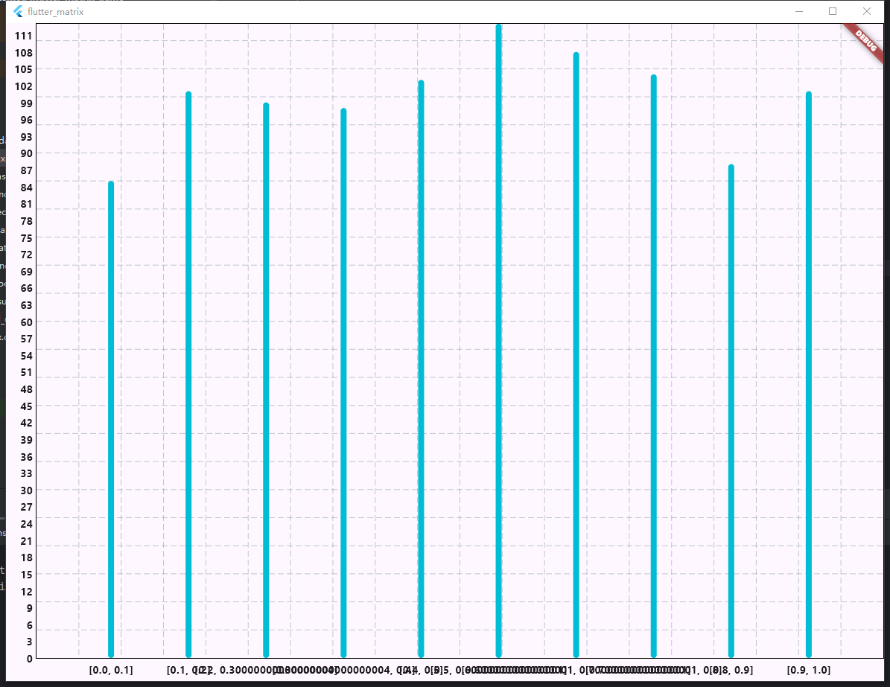
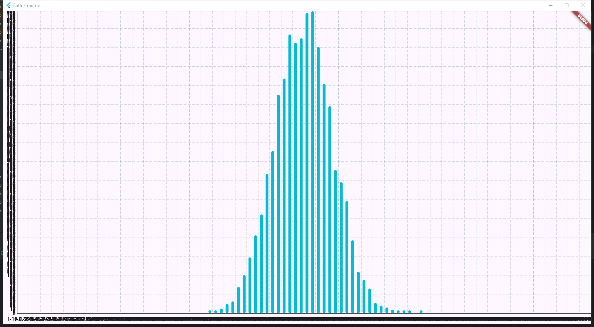

# 概率论与数理统计

## mean
> Object mean({int dim = -1})
> 
> 求均值
### test
```text
import 'package:flutter_matrix/matrix_type.dart';

main() {
  var mt = Matrix.fromList([
    [1, 2, 3, 4],
    [double.infinity, 2, 2, 3],
    [0, 4, 6, -2]
  ]);
  print(mt.mean(dim: 0));
  print(mt.mean(dim: 1));
  print(mt.mean(dim: 2));
}
```
### output
```text
[2.5, Infinity, 2.0]
[Infinity, 2.0, 2.75, 1.25]
Infinity
```
## median
> Object median({int dim = -1})
> 
> 求中位数
### test
```text
import 'package:flutter_matrix/matrix_type.dart';

main() {
  var mt = Matrix.fromList([
    [1, 2, 3, 4, 6, 7, 10],
    [double.infinity, 2, 2, 3, 4, 7, -65],
    [0, 4, 6, -2, 1, -2, -2]
  ]);
  print(mt.median(dim: 0));
  print(mt.median(dim: 1));
  print(mt.median(dim: 2));
}
```
### output
```text
[4.0, 3.0, 0.0]
[1.0, 2.0, 3.0, 3.0, 4.0, 7.0, -2.0]
3.0
```
## mode
> Object mode({int dim = -1})
> 
> 求众数
### test
```text
import 'package:flutter_matrix/matrix_type.dart';

main() {
  var mt = Matrix.fromList([
    [1, 2, 3, 4, 6, 7, 10],
    [double.infinity, 2, 2, 3, 4, 7, -65],
    [0, 4, 6, -2, 1, -2, -2],
    [double.infinity, 2, 2, 3, 4, 7, -65],
  ]);
  print(mt.mode(dim: 0));
  print(mt.mode(dim: 1));
  print(mt.mode(dim: 2));
}
```
### output
```text
[1.0, 2.0, -2.0, 2.0]
[Infinity, 2.0, 2.0, 3.0, 4.0, 7.0, -65.0]
2.0
```
## shuffle
> void shuffle({int? seed, int dim = -1})
> 
> 随机打乱，seed是随时数种子
### test
```text
import 'package:flutter_matrix/matrix_type.dart';

main() {
  data_format = "%2.2f";
  Matrix.linspace(start: 0, end: 1, row: 5, column: 10)..visible();
  var m12 = Matrix.linspace(start: 0, end: 1, row: 5, column: 10);
  var m13 = Matrix.linspace(start: 0, end: 1, row: 5, column: 10);
  var m14 = Matrix.linspace(start: 0, end: 1, row: 5, column: 10);
  m12..shuffle(dim: 0)..visible();
  m13..shuffle(dim: 1)..visible();
  m14..shuffle(dim: 10)..visible();
}
```
### output
```text
[
 [ 0.00  0.02  0.04  0.06  0.08  0.10  0.12  0.14  0.16  0.18]
 [ 0.20  0.22  0.24  0.27  0.29  0.31  0.33  0.35  0.37  0.39]
 [ 0.41  0.43  0.45  0.47  0.49  0.51  0.53  0.55  0.57  0.59]
 [ 0.61  0.63  0.65  0.67  0.69  0.71  0.73  0.76  0.78  0.80]
 [ 0.82  0.84  0.86  0.88  0.90  0.92  0.94  0.96  0.98  1.00]
]
[
 [ 0.06  0.18  0.14  0.16  0.02  0.12  0.08  0.04  0.10  0.00]
 [ 0.29  0.20  0.39  0.31  0.22  0.35  0.37  0.27  0.24  0.33]
 [ 0.41  0.47  0.57  0.49  0.51  0.55  0.43  0.45  0.59  0.53]
 [ 0.67  0.73  0.63  0.71  0.61  0.65  0.76  0.80  0.69  0.78]
 [ 1.00  0.94  0.98  0.92  0.96  0.88  0.90  0.86  0.84  0.82]
]
[
 [ 0.20  0.84  0.04  0.27  0.29  0.92  0.53  0.35  0.98  0.80]
 [ 0.82  0.22  0.24  0.06  0.90  0.51  0.94  0.96  0.16  0.18]
 [ 0.41  0.02  0.86  0.88  0.49  0.31  0.12  0.76  0.57  0.39]
 [ 0.00  0.63  0.45  0.67  0.08  0.10  0.73  0.14  0.78  1.00]
 [ 0.61  0.43  0.65  0.47  0.69  0.71  0.33  0.55  0.37  0.59]
]
[
 [ 0.55  0.41  0.96  0.27  0.92  0.82  0.57  0.39  0.73  0.63]
 [ 0.88  0.29  0.43  0.98  0.22  0.78  0.94  0.45  0.76  0.37]
 [ 0.69  0.16  0.84  1.00  0.90  0.71  0.20  0.51  0.53  0.49]
 [ 0.08  0.33  0.65  0.31  0.10  0.59  0.18  0.02  0.86  0.67]
 [ 0.80  0.04  0.61  0.06  0.35  0.14  0.00  0.47  0.12  0.24]
]
```
## uniform
> static Matrix uniform({double lb = 0.0, double ub = 1.0, required int row, required int column, int? seed})
> 
> 均匀分布
### test
```text
import 'package:flutter/material.dart';
import 'package:fl_chart/fl_chart.dart';
import 'flutter_matrix.dart';

void main() {
  runApp(const MyApp());
}

class MyApp extends StatelessWidget {
  const MyApp({super.key});

  // This widget is the root of your application.
  @override
  Widget build(BuildContext context) {
    return MaterialApp(
      title: 'Flutter Demo',
      theme: ThemeData(
        colorScheme: ColorScheme.fromSeed(seedColor: Colors.deepPurple),
        useMaterial3: true,
      ),
      home: const MyHomePage(),
    );
  }
}

class MyHomePage extends StatefulWidget {
  const MyHomePage({super.key});

  @override
  State<MyHomePage> createState() => _MyHomePageState();
}

class _MyHomePageState extends State<MyHomePage> {
  // 生成1K个标准均匀分布的数据并且使用柱状图可视化
  static Matrix datas = MatrixRandom.uniform(row: 1, column: 1000, seed: 42);
  static Map<List<double>, int> maps = datas.toHist(start: 0.0, end: 1.0, counts: 10);
  var ls = maps.keys.toList();

  FlTitlesData get titlesData => FlTitlesData(
    show: true,
    bottomTitles: AxisTitles(
      sideTitles: SideTitles(
        showTitles: true,
        reservedSize: 30,
        getTitlesWidget: getTitles,
      ),
    ),
    leftTitles: AxisTitles(
      sideTitles: SideTitles(
        showTitles: true, // 设置为 true 显示左侧 Y 轴刻度
        reservedSize: 40, // 留出空间
        interval: 3, // 设置刻度间隔
        getTitlesWidget: getLeftTitles, // 自定义左侧刻度标签
      ),
    ),
    topTitles: const AxisTitles(
      sideTitles: SideTitles(showTitles: false),
    ),
    rightTitles: const AxisTitles(
      sideTitles: SideTitles(showTitles: false),
    ),
  );

  // 自定义 Y 轴刻度标签
  Widget getLeftTitles(double value, TitleMeta meta) {
    final style = TextStyle(
      fontWeight: FontWeight.bold,
      fontSize: 14,
    );
    String text;
    if (value % 3 == 0) { // 仅在指定刻度显示标签
      text = value.toInt().toString();
    } else {
      text = '';
    }
    return SideTitleWidget(
      meta: meta,
      space: 4,
      child: Text(text, style: style),
    );
  }

  Widget getTitles(double value, TitleMeta meta) {
    final style = TextStyle(
      fontWeight: FontWeight.bold,
      fontSize: 14,
    );
    String text = ls[value.toInt()].toString();
    return SideTitleWidget(
      meta: meta,
      space: 4,
      child: Text(text, style: style),
    );
  }

  List<BarChartGroupData> buildGroup(){
    return List<BarChartGroupData>.generate(ls.length, (r){
      return BarChartGroupData(
        x: r,
        barRods: [
          BarChartRodData(toY: maps.values.elementAt(r).toDouble()),
        ]
      );
    });
  }

  @override
  Widget build(BuildContext context) {
    return Scaffold(
      body: Center(
        child: BarChart(
          BarChartData(
            barGroups: buildGroup(),
            titlesData: titlesData,
          ),
        ),
      ),
    );
  }
}
```
### output

## normal
> static Matrix normal({double mu = 0.0, double sigma = 1.0, required int row, required int column, int? seed})
> 
> 正态分布
### test
```text
static Matrix datas = MatrixRandom.normal(row: 1, column: 10000, seed: 42);
static Map<List<double>, int> maps = datas.toHist(start: -10.0, end: 10.0, counts: 100);
var ls = maps.keys.toList();
```
### output

## shake_total
> void shake_total({double bias = 1.0, int? seed})
> 
> 对整体数据随机上下限抖动最大abs(bias)值
### test
```text
import 'package:flutter_matrix/matrix_type.dart';

main() {
  var mt = Matrix.fill(number: 2, row: 4, column: 6)..visible();
  mt..shake_total(bias: 1, seed: 3)..visible();
}
```
### output
```text
[
 [2.00000 2.00000 2.00000 2.00000 2.00000 2.00000]
 [2.00000 2.00000 2.00000 2.00000 2.00000 2.00000]
 [2.00000 2.00000 2.00000 2.00000 2.00000 2.00000]
 [2.00000 2.00000 2.00000 2.00000 2.00000 2.00000]
]
[
 [1.84526 1.93082 1.21542 1.07671 2.73399 1.04996]
 [2.86985 1.04787 2.03070 2.86932 1.36468 2.91896]
 [2.23152 2.47494 2.37738 2.75460 1.98057 2.90156]
 [1.61362 1.21451 2.29266 1.64790 2.31230 1.48668]
]
```
## shake_percent
> void shake_percent({double bias = 1.0, double percent = 0.5, int? seed})
> 
> 随机抖动percent占比的数据
### test
```text
import 'package:flutter_matrix/matrix_type.dart';

main() {
  var mt = Matrix.fill(number: 2, row: 4, column: 6)..visible();
  mt..shake_percent(bias: 1, seed: 3, percent: 0.5)..visible();
  print(mt.count((x) => x == 2) == 4 * 6 ~/ 2);
} 
```
### output
```text
[
 [2.00000 2.00000 2.00000 2.00000 2.00000 2.00000]
 [2.00000 2.00000 2.00000 2.00000 2.00000 2.00000]
 [2.00000 2.00000 2.00000 2.00000 2.00000 2.00000]
 [2.00000 2.00000 2.00000 2.00000 2.00000 2.00000]
]
[
 [2.00000 2.00000 1.04996 1.04787 2.00000 1.21542]
 [1.07671 2.00000 2.00000 2.86932 1.36468 2.03070]
 [1.93082 2.86985 2.00000 2.91896 2.00000 2.00000]
 [1.84526 2.00000 2.73399 2.00000 2.00000 2.00000]
]
true
```
## shake_probably
> void shake_probably({double bias = 1.0, double p = 0.5, int? seed})
> 
> 按照概率对数据随机抖动
### test
```text
import 'package:flutter_matrix/matrix_type.dart';

main() {
  var mt = Matrix.fill(number: 2, row: 4, column: 6)..visible();
  mt..shake_probably(bias: 1, seed: 3, p: 0.25)..visible();
} 
```
### output
```text
[
 [2.00000 2.00000 2.00000 2.00000 2.00000 2.00000]
 [2.00000 2.00000 2.00000 2.00000 2.00000 2.00000]
 [2.00000 2.00000 2.00000 2.00000 2.00000 2.00000]
 [2.00000 2.00000 2.00000 2.00000 2.00000 2.00000]
]
[
 [2.00000 1.19765 2.00000 1.59960 2.00000 2.00000]
 [2.00000 2.00000 2.00000 1.29358 2.16905 2.00000]
 [2.00000 2.00000 2.00000 2.00000 2.00000 2.00000]
 [2.00000 2.00000 2.00000 2.00000 2.00000 2.00000]
]
```

[下一篇：线性代数](linalg.md)