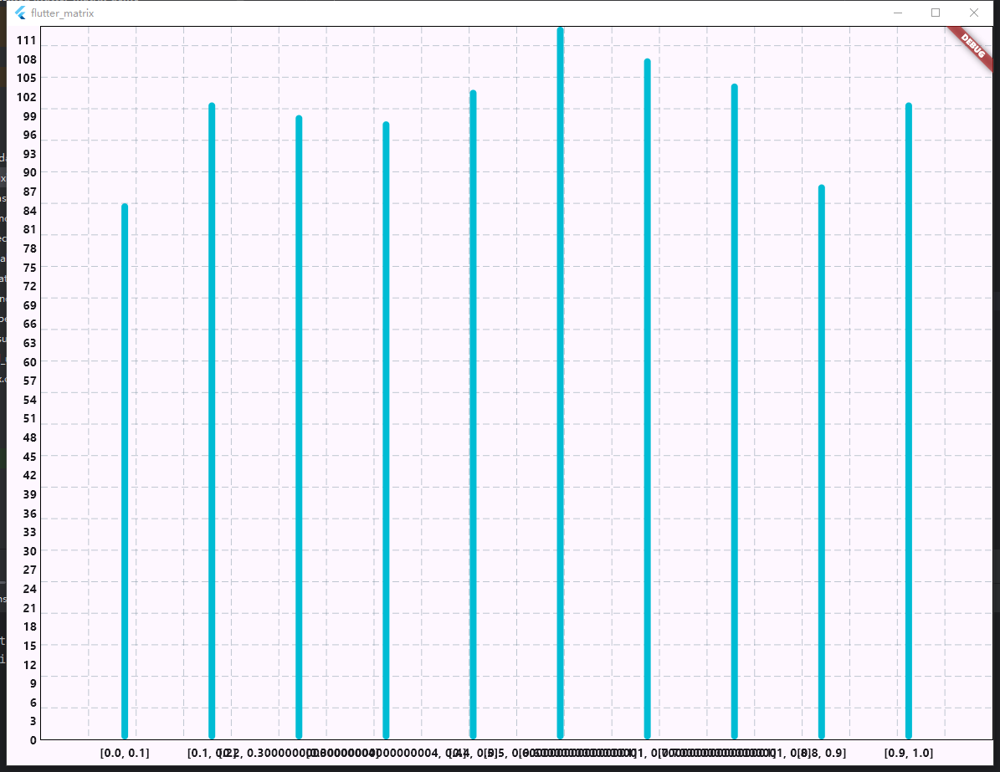
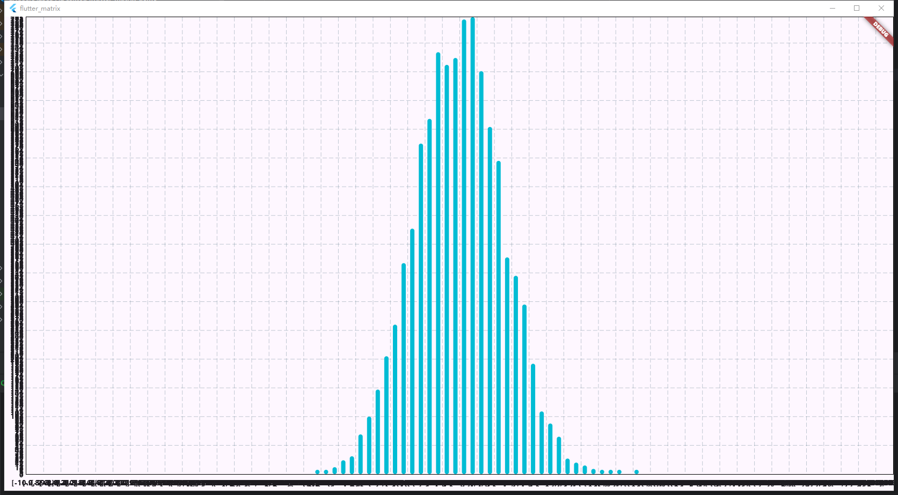

# 概率论与数理统计

## mean
> Object mean({int dim = -1})
> 
> 求均值
### test
```text
import 'package:flutter_matrix/matrix_type.dart';

main() {
  var mt = Matrix.fromList([
    [1, 2, 3, 4],
    [double.infinity, 2, 2, 3],
    [0, 4, 6, -2]
  ]);
  print(mt.mean(dim: 0));
  print(mt.mean(dim: 1));
  print(mt.mean(dim: 2));
}
```
### output
```text
[2.5, Infinity, 2.0]
[Infinity, 2.0, 2.75, 1.25]
Infinity
```
## median
> Object median({int dim = -1})
> 
> 求中位数
### test
```text
import 'package:flutter_matrix/matrix_type.dart';

main() {
  var mt = Matrix.fromList([
    [1, 2, 3, 4, 6, 7, 10],
    [double.infinity, 2, 2, 3, 4, 7, -65],
    [0, 4, 6, -2, 1, -2, -2]
  ]);
  print(mt.median(dim: 0));
  print(mt.median(dim: 1));
  print(mt.median(dim: 2));
}
```
### output
```text
[4.0, 3.0, 0.0]
[1.0, 2.0, 3.0, 3.0, 4.0, 7.0, -2.0]
3.0
```
## mode
> Object mode({int dim = -1})
> 
> 求众数
### test
```text
import 'package:flutter_matrix/matrix_type.dart';

main() {
  var mt = Matrix.fromList([
    [1, 2, 3, 4, 6, 7, 10],
    [double.infinity, 2, 2, 3, 4, 7, -65],
    [0, 4, 6, -2, 1, -2, -2],
    [double.infinity, 2, 2, 3, 4, 7, -65],
  ]);
  print(mt.mode(dim: 0));
  print(mt.mode(dim: 1));
  print(mt.mode(dim: 2));
}
```
### output
```text
[1.0, 2.0, -2.0, 2.0]
[Infinity, 2.0, 2.0, 3.0, 4.0, 7.0, -65.0]
2.0
```
## shuffle
> void shuffle({int? seed, int dim = -1})
> 
> 随机打乱，seed是随时数种子
### test
```text
import 'package:flutter_matrix/matrix_type.dart';

main() {
  data_format = "%2.2f";
  Matrix.linspace(start: 0, end: 1, row: 5, column: 10)..visible();
  var m12 = Matrix.linspace(start: 0, end: 1, row: 5, column: 10);
  var m13 = Matrix.linspace(start: 0, end: 1, row: 5, column: 10);
  var m14 = Matrix.linspace(start: 0, end: 1, row: 5, column: 10);
  m12..shuffle(dim: 0)..visible();
  m13..shuffle(dim: 1)..visible();
  m14..shuffle(dim: 10)..visible();
}
```
### output
```text
[
 [ 0.00  0.02  0.04  0.06  0.08  0.10  0.12  0.14  0.16  0.18]
 [ 0.20  0.22  0.24  0.27  0.29  0.31  0.33  0.35  0.37  0.39]
 [ 0.41  0.43  0.45  0.47  0.49  0.51  0.53  0.55  0.57  0.59]
 [ 0.61  0.63  0.65  0.67  0.69  0.71  0.73  0.76  0.78  0.80]
 [ 0.82  0.84  0.86  0.88  0.90  0.92  0.94  0.96  0.98  1.00]
]
[
 [ 0.06  0.18  0.14  0.16  0.02  0.12  0.08  0.04  0.10  0.00]
 [ 0.29  0.20  0.39  0.31  0.22  0.35  0.37  0.27  0.24  0.33]
 [ 0.41  0.47  0.57  0.49  0.51  0.55  0.43  0.45  0.59  0.53]
 [ 0.67  0.73  0.63  0.71  0.61  0.65  0.76  0.80  0.69  0.78]
 [ 1.00  0.94  0.98  0.92  0.96  0.88  0.90  0.86  0.84  0.82]
]
[
 [ 0.20  0.84  0.04  0.27  0.29  0.92  0.53  0.35  0.98  0.80]
 [ 0.82  0.22  0.24  0.06  0.90  0.51  0.94  0.96  0.16  0.18]
 [ 0.41  0.02  0.86  0.88  0.49  0.31  0.12  0.76  0.57  0.39]
 [ 0.00  0.63  0.45  0.67  0.08  0.10  0.73  0.14  0.78  1.00]
 [ 0.61  0.43  0.65  0.47  0.69  0.71  0.33  0.55  0.37  0.59]
]
[
 [ 0.55  0.41  0.96  0.27  0.92  0.82  0.57  0.39  0.73  0.63]
 [ 0.88  0.29  0.43  0.98  0.22  0.78  0.94  0.45  0.76  0.37]
 [ 0.69  0.16  0.84  1.00  0.90  0.71  0.20  0.51  0.53  0.49]
 [ 0.08  0.33  0.65  0.31  0.10  0.59  0.18  0.02  0.86  0.67]
 [ 0.80  0.04  0.61  0.06  0.35  0.14  0.00  0.47  0.12  0.24]
]
```
## uniform
> static Matrix uniform({double lb = 0.0, double ub = 1.0, required int row, required int column, int? seed})
> 
> 均匀分布
### test
```text
import 'package:flutter/material.dart';
import 'package:fl_chart/fl_chart.dart';
import 'flutter_matrix.dart';

void main() {
  runApp(const MyApp());
}

class MyApp extends StatelessWidget {
  const MyApp({super.key});

  // This widget is the root of your application.
  @override
  Widget build(BuildContext context) {
    return MaterialApp(
      title: 'Flutter Demo',
      theme: ThemeData(
        colorScheme: ColorScheme.fromSeed(seedColor: Colors.deepPurple),
        useMaterial3: true,
      ),
      home: const MyHomePage(),
    );
  }
}

class MyHomePage extends StatefulWidget {
  const MyHomePage({super.key});

  @override
  State<MyHomePage> createState() => _MyHomePageState();
}

class _MyHomePageState extends State<MyHomePage> {
  // 生成1K个标准均匀分布的数据并且使用柱状图可视化
  static Matrix datas = MatrixRandom.uniform(row: 1, column: 1000, seed: 42);
  static Map<List<double>, int> maps = datas.toHist(start: 0.0, end: 1.0, counts: 10);
  var ls = maps.keys.toList();

  FlTitlesData get titlesData => FlTitlesData(
    show: true,
    bottomTitles: AxisTitles(
      sideTitles: SideTitles(
        showTitles: true,
        reservedSize: 30,
        getTitlesWidget: getTitles,
      ),
    ),
    leftTitles: AxisTitles(
      sideTitles: SideTitles(
        showTitles: true, // 设置为 true 显示左侧 Y 轴刻度
        reservedSize: 40, // 留出空间
        interval: 3, // 设置刻度间隔
        getTitlesWidget: getLeftTitles, // 自定义左侧刻度标签
      ),
    ),
    topTitles: const AxisTitles(
      sideTitles: SideTitles(showTitles: false),
    ),
    rightTitles: const AxisTitles(
      sideTitles: SideTitles(showTitles: false),
    ),
  );

  // 自定义 Y 轴刻度标签
  Widget getLeftTitles(double value, TitleMeta meta) {
    final style = TextStyle(
      fontWeight: FontWeight.bold,
      fontSize: 14,
    );
    String text;
    if (value % 3 == 0) { // 仅在指定刻度显示标签
      text = value.toInt().toString();
    } else {
      text = '';
    }
    return SideTitleWidget(
      meta: meta,
      space: 4,
      child: Text(text, style: style),
    );
  }

  Widget getTitles(double value, TitleMeta meta) {
    final style = TextStyle(
      fontWeight: FontWeight.bold,
      fontSize: 14,
    );
    String text = ls[value.toInt()].toString();
    return SideTitleWidget(
      meta: meta,
      space: 4,
      child: Text(text, style: style),
    );
  }

  List<BarChartGroupData> buildGroup(){
    return List<BarChartGroupData>.generate(ls.length, (r){
      return BarChartGroupData(
        x: r,
        barRods: [
          BarChartRodData(toY: maps.values.elementAt(r).toDouble()),
        ]
      );
    });
  }

  @override
  Widget build(BuildContext context) {
    return Scaffold(
      body: Center(
        child: BarChart(
          BarChartData(
            barGroups: buildGroup(),
            titlesData: titlesData,
          ),
        ),
      ),
    );
  }
}
```
### output

## normal
> static Matrix normal({double mu = 0.0, double sigma = 1.0, required int row, required int column, int? seed})
> 
> 正态分布
### test
```text
static Matrix datas = MatrixRandom.normal(row: 1, column: 10000, seed: 42);
static Map<List<double>, int> maps = datas.toHist(start: -10.0, end: 10.0, counts: 100);
var ls = maps.keys.toList();
```
### output

## shake_total
> void shake_total({double bias = 1.0, int? seed})
> 
> 对整体数据随机上下限抖动最大abs(bias)值
### test
```text
import 'package:flutter_matrix/matrix_type.dart';

main() {
  var mt = Matrix.fill(number: 2, row: 4, column: 6)..visible();
  mt..shake_total(bias: 1, seed: 3)..visible();
}
```
### output
```text
[
 [2.00000 2.00000 2.00000 2.00000 2.00000 2.00000]
 [2.00000 2.00000 2.00000 2.00000 2.00000 2.00000]
 [2.00000 2.00000 2.00000 2.00000 2.00000 2.00000]
 [2.00000 2.00000 2.00000 2.00000 2.00000 2.00000]
]
[
 [1.84526 1.93082 1.21542 1.07671 2.73399 1.04996]
 [2.86985 1.04787 2.03070 2.86932 1.36468 2.91896]
 [2.23152 2.47494 2.37738 2.75460 1.98057 2.90156]
 [1.61362 1.21451 2.29266 1.64790 2.31230 1.48668]
]
```
## shake_percent
> void shake_percent({double bias = 1.0, double percent = 0.5, int? seed})
> 
> 随机抖动percent占比的数据
### test
```text
import 'package:flutter_matrix/matrix_type.dart';

main() {
  var mt = Matrix.fill(number: 2, row: 4, column: 6)..visible();
  mt..shake_percent(bias: 1, seed: 3, percent: 0.5)..visible();
  print(mt.count((x) => x == 2) == 4 * 6 ~/ 2);
} 
```
### output
```text
[
 [2.00000 2.00000 2.00000 2.00000 2.00000 2.00000]
 [2.00000 2.00000 2.00000 2.00000 2.00000 2.00000]
 [2.00000 2.00000 2.00000 2.00000 2.00000 2.00000]
 [2.00000 2.00000 2.00000 2.00000 2.00000 2.00000]
]
[
 [2.00000 2.00000 1.04996 1.04787 2.00000 1.21542]
 [1.07671 2.00000 2.00000 2.86932 1.36468 2.03070]
 [1.93082 2.86985 2.00000 2.91896 2.00000 2.00000]
 [1.84526 2.00000 2.73399 2.00000 2.00000 2.00000]
]
true
```
## shake_probably
> void shake_probably({double bias = 1.0, double p = 0.5, int? seed})
> 
> 按照概率对数据随机抖动
### test
```text
import 'package:flutter_matrix/matrix_type.dart';

main() {
  var mt = Matrix.fill(number: 2, row: 4, column: 6)..visible();
  mt..shake_probably(bias: 1, seed: 3, p: 0.25)..visible();
} 
```
### output
```text
[
 [2.00000 2.00000 2.00000 2.00000 2.00000 2.00000]
 [2.00000 2.00000 2.00000 2.00000 2.00000 2.00000]
 [2.00000 2.00000 2.00000 2.00000 2.00000 2.00000]
 [2.00000 2.00000 2.00000 2.00000 2.00000 2.00000]
]
[
 [2.00000 1.19765 2.00000 1.59960 2.00000 2.00000]
 [2.00000 2.00000 2.00000 1.29358 2.16905 2.00000]
 [2.00000 2.00000 2.00000 2.00000 2.00000 2.00000]
 [2.00000 2.00000 2.00000 2.00000 2.00000 2.00000]
]
```

## binomial
> static Matrix binomial({required int n, required double p, required int row, required int column, int? seed})
> 
> 二项式分布（伯努利分布），其中n是试验次数，p是成功的概率。

### test
```text
import '../lib/flutter_matrix.dart';

main(){
  data_format = '%2.0f';
  var mt = MatrixRandom.binomial(n: 10, p: 0.6, row: 3, column: 6);
  mt.visible();
}
```
### output
```text
[
 [  9   5   6   6   6   7]
 [  6   7   6   5   5   6]
 [  5   5   7   4   9   6]
]
```
## chisquare
> static Matrix chisquare({ required int df, required int row, required int column, int? seed })
> 
> 卡方分布，其中正整数df是自由度。
### test
```text
import '../lib/flutter_matrix.dart';

main(){
  var mt = MatrixRandom.chisquare(df: 3, row: 3, column: 6);
  mt.visible();
}
```
### output
```text
[
 [5.42309 5.67948 0.43278 9.90406 0.08491 0.75004]
 [0.69392 1.83211 4.31445 3.21911 9.51412 7.66674]
 [4.24697 0.43563 1.39504 4.06116 0.95671 3.23452]
]
```
## exponential
> static Matrix exponential({ required double lambda, required int row, required int column, int? seed })
> 
> 指数分布，正实数λ是速率参数。
### test
```text
import '../lib/flutter_matrix.dart';

main(){
  var mt = MatrixRandom.exponential(lambda: 3, row: 3, column: 7);
  mt.visible();
}
```
### output
```text
[
 [0.59205 0.30458 0.44661 0.37097 0.68382 0.37191 0.19418]
 [0.87269 0.48058 0.11004 0.41595 0.09100 0.68939 0.04317]
 [0.08204 0.16524 1.15535 0.70234 0.04674 0.30218 0.07011]
]
```
## f
> static Matrix f({ required int d1, required int d2, required int row, required int column, int? seed })
> 
> F 分布。其中 d1 和 d2 ] 是两个独立卡方分布的自由度。
### test
```text
import '../lib/flutter_matrix.dart';

main(){
  data_format = "%2.5f";
  var mt = MatrixRandom.f(d1: 3, d2: 4, row: 4, column: 6);
  mt.visible();
}
```
### output
```text
[
 [ 0.92346  0.66244  3.03371  0.18384  0.63915  0.97611]
 [ 0.91794  0.54395  0.33545  1.28692  0.01852  1.13263]
 [ 2.17837  0.24876  3.40228  0.11621  0.76633  0.47811]
 [ 1.02146  4.00121  0.25865  2.29399  2.07985  0.07998]
]
```
## gamma
> static Matrix gamma({ required double k, required double theta, required int row, required int column, int? seed })
> 
> 伽马分布，其中k是形状参数，theta是尺度参数。
### test
```text
import '../lib/flutter_matrix.dart';

main(){
  data_format = "%2.5f";
  var mt = MatrixRandom.gamma(k: 2.3, theta: 1.2, row: 2, column: 9);
  mt.visible();
}
```
### output
```text
[
 [ 1.97898  2.11548  1.97235  2.01070  1.97023  2.15622  1.96931  1.96695  1.97193]
 [ 1.99453  1.98793  1.98049  1.99853  2.01608  2.06490  1.96879  2.18777  2.01119]
]
```
## beta
> static Matrix beta({ required double a, required double b, required int row, required int column, int? seed })
> 
> 贝塔分布，参数a和b分别是分子和分母的形状参数。
### test
```text
import '../lib/flutter_matrix.dart';

main(){
  data_format = "%2.5f";
  var mt = MatrixRandom.beta(a: 1.4, b: 1.5, row: 3, column: 6);
  mt.visible();
}
```
### output
```text
[
 [ 0.49674  0.47748  0.49000  0.51771  0.48358  0.53437]
 [ 0.47219  0.48763  0.47852  0.48319  0.45656  0.46501]
 [ 0.47745  0.47656  0.47766  0.48641  0.46924  0.47451]
]
```
## dirichlet
> static Matrix dirichlet({ required List<double> alpha, required int row, int? seed })
> 
> 狄利克雷分布，alpha参数是长度为列且不小于2的浮点序列，alpha中的每个数都必须大于0。
### test
```text
import '../lib/flutter_matrix.dart';

main(){
  data_format = "%2.5f";
  var mt = MatrixRandom.dirichlet(alpha: [2, 3, 4, 5, 2, 1, 1, 9], row: 5);
  mt.visible();
}
```
### output
```
[
 [ 0.06777  0.10927  0.14974  0.19033  0.06799  0.02707  0.03108  0.35675]
 [ 0.06782  0.10716  0.15432  0.18717  0.07829  0.02750  0.02718  0.35056]
 [ 0.07176  0.11077  0.14973  0.19066  0.06803  0.02759  0.02731  0.35416]
 [ 0.06923  0.10830  0.15226  0.19454  0.06776  0.02710  0.02705  0.35375]
 [ 0.06978  0.10861  0.14912  0.19070  0.06796  0.03449  0.02751  0.35182]
]
``` 
## geometric
> static Matrix geometric({ required double p, required int row, required int column, int? seed })
> 
> 几何分布，其中p是成功的概率。
### test
```text
import '../lib/flutter_matrix.dart';

main(){
  data_format = "%2.0f";
  var mt = MatrixRandom.geometric(p: 0.1, row: 4, column: 7);
  mt.visible();
}
```
### output
```text
[
 [  1   3   1   1  33   2  15]
 [  4   3   2   6   1  12  18]
 [ 24   2   6   9  33   7   2]
 [  6   7  11   5  16   4  10]
]
```
## gumbel
> static Matrix gumbel({ required double loc, required double scale, required int row, required int column, int? seed })
> 
> 耿贝尔分布，其中loc是分布的众数的位置，scale是分布的尺度参数，并且必须为非负数。
### test
```text
import '../lib/flutter_matrix.dart';

main(){
  data_format = "%2.5f";
  var mt = MatrixRandom.gumbel(loc: 0, scale: 1, row: 2, column: 9);
  mt.visible();
}
```
### output
```text
[
 [-0.22699 -0.70834  2.46328 -0.27267  1.13736 -0.50648  0.10226  1.58143  3.05194]
 [ 1.54331 -0.05892  0.14372  3.15481  0.44702  0.25944 -0.13567  0.74313  0.23801]
]
```
## hypergeometric
> static Matrix hypergeometric({ required int N, required int K, required int n, required int row, required int column, int? seed })
> 
> 超几何分布，参数N、K、n分别表示元素总数、目标元素总数、抽取的样本数，最终得到样本中目标元素的数量。
### test
```text
import '../lib/flutter_matrix.dart';

main(){
  data_format = "%2.0f";
  var mt = MatrixRandom.hypergeometric(N: 100, K: 10, n: 50, row: 6, column: 6);
  mt.visible();
}
```
### output
```text
[
 [  2   8   6   6   5   3]
 [  4   4   2   7   3   5]
 [  6   2   2   7   6   3]
 [  3   5   5   7   6   7]
 [  7   8   6   7   5   5]
 [  5   4   7   8   4   3]
]
```
## laplace
> static Matrix laplace({ required double mu, required double b, required int row, required int column, int? seed })
> 
> 拉普拉斯分布，又称双指数分布，mu是位置参数，非负数b是尺度参数。
### test
```text
import '../lib/flutter_matrix.dart';

main(){
  data_format = "%2.5f";
  var mt = MatrixRandom.laplace(mu: 1, b: 2, row: 2, column: 8);
  mt.visible();
}
```
### output
```text
[
 [ 5.15415  2.07610 -1.37176 -2.41060 -0.99129  3.98637  0.31916  0.24522]
 [ 3.38619  4.86480 -1.78386  0.54009 -4.79726  4.24814  2.09560  2.00870]
]
```

[下一篇：线性代数](linalg.md)