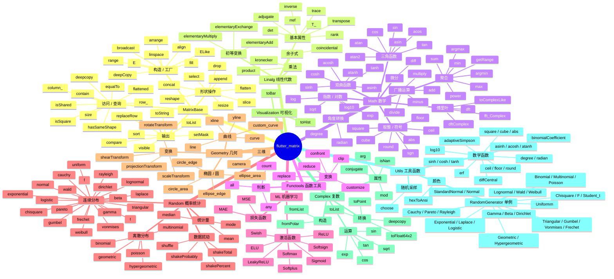

```mermaid
mindmap
  root((flutter_matrix))
    MatrixBase
      构造 / 工厂
        fill
        arrange
        range
        linspace
        E
        ELike
        deepCopy
        broadcast
        align
      形状操作
        reshape
        resize
        flatten
        concat
        slice
        select
        drop
        append
      访问 / 查询
        row_
        column_
        contain
        equalTo
        isShared
        hasSameShape
        size
        flattened
        isSquare
        deepcopy
      输出
        toString
        visible
        setMask
        toList
        replaceRow
        sort
        compare

    Linalg 线性代数
      基本属性
        det
        rank
        trace
        inverse
        adjugate
        rref
        T_
        transpose
      乘法
        product
        kronecker
      初等变换
        elementaryExchange
        elementaryMultiply
        elementaryAdd
      余子式
        coincidental

    Math 数学
      三角函数
        sin
        cos
        tan
        asin
        acos
        atan
        atan2
      双曲函数
        sinh
        cosh
        tanh
        asinh
        acosh
        atanh
      指数 / 对数
        exp
        log
        log10
        sqrt
      取整 / 符号
        abs
        ceil
        floor
        round
        sgn
        square
        cube
      角度转换
        degree
        radian
      聚合
        min
        max
        sum
        argmin
        argmax
        getRange
        power
      广播运算
        add
        minus
        multiply
        divide
      傅里叶
        fft_Complex
        dftComplex
        dft
        toComplexLike
      微分
        diff

    Functools 函数工具
      判断
        any
        all
        count
      变换
        customize
        confront
        clip
        replace
        reduce

    ML 机器学习
      激活函数
        ReLU
        LeakyReLU
        ELU
        Sigmoid
        Softmax
        Swish
        Softsign
        Softplus
      损失函数
        MAE
        MSE

    Random 概率统计
      统计量
        mean
        median
        mode
      数据扰动
        shakeTotal
        shakePercent
        shakeProbably
        shuffle
      连续分布
        uniform
        normal
        exponential
        gamma
        beta
        dirichlet
        laplace
        logistic
        lognormal
        cauchy
        pareto
        rayleigh
        triangular
        wald
        weibull
        vonmises
        gumbel
        frechet
        chisquare
        f
        t
      离散分布
        binomial
        geometric
        hypergeometric
        multinomial
        poisson

    Geometry 几何
      变换
        rotateTransform
        projectionTransform
        shearTransform
        scaleTransform
      曲线
        curve
        custom_curve
        line
        xline
        yline
      椭圆 / 圆
        ellipse_edge
        ellipse_area
        circle_edge
        circle_area
      三维
        camera

    Visualization 可视化
      toHist
      toBar

    Complex 复数
      构造
        fromPolar
        fromList
      属性
        mod
        arg
        conjugate
        isNan
      运算
        exp
        sqrt
        sin
        cos
        tan
      转换
        toList
        toPoint
        toFloat64x2
        deepcopy

    Utils 工具函数
      数学函数
        sinh / cosh / tanh
        asinh / acosh / atanh
        log10
        square / cube / abs
        ceil / floor / round
        degree / radian
        diffCentral
        adaptiveSimpson
        binomialCoefficient
        erf
      随机采样
        choose
      颜色
        hexToAnsi
      RandomGenerator 单例
        StandardNormal / Normal
        Uniformm
        Binomial / Multinomial / Poisson
        Geometric / Hypergeometric
        Gamma / Beta / Dirichlet
        Chisquare / F / Student_t
        Exponential / Laplace / Logistic
        Lognormal / Wald / Weibull
        Cauchy / Pareto / Rayleigh
        Triangular / Gumbel / Vonmises / Frechet
```
